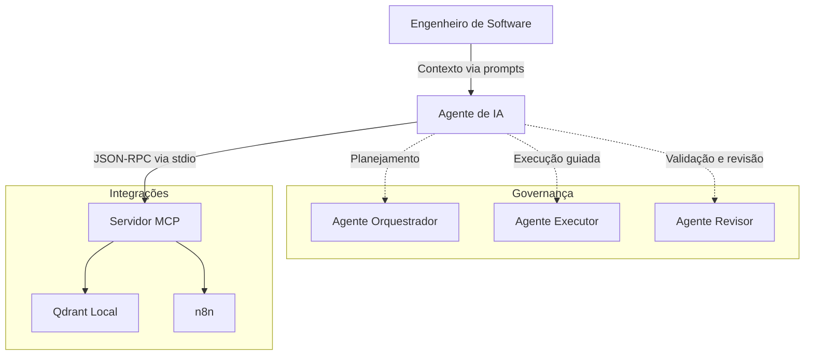

# Personal Dev Workspace — Platform Engineering (Cloud & MLOps)

Repositório central para padronização de ambiente de desenvolvimento, automação local, templates de infraestrutura, rotinas operacionais e organização de ferramentas de apoio para engenharia de plataforma.

    

---

## Visão geral

Este repositório consolida os principais componentes do meu workspace de engenharia de plataforma. O objetivo é manter um ambiente reproduzível, organizado e versionado, com foco em:

- automação de setup local
- gerenciamento de dotfiles
- templates de infraestrutura com Terraform
- rotinas operacionais e checklists
- validações locais de qualidade e sanidade
- organização de apoio para uso controlado de agentes de IA

A proposta é reduzir configuração manual, aumentar previsibilidade e manter um padrão único para operação e evolução do ambiente de trabalho.

---

## Estrutura do projeto

O repositório está organizado em cinco frentes principais:

1. **Automação de máquina e dotfiles**  
   Provisionamento e configuração do ambiente local com Ansible, scripts de bootstrap e GNU Stow.

2. **Infraestrutura como código**  
   Templates e estruturas reutilizáveis em Terraform para provisionamento e experimentação em cloud.

3. **Governança de agentes de IA**  
   Documentação, regras operacionais e integrações locais para uso mais controlado de ferramentas assistidas por IA.

4. **Rotina operacional**  
   Checklists, playbooks e apoio à rotina de trabalho diária.

5. **Qualidade e validação**  
   Hooks locais, linting e verificações de ambiente antes de alterações ou pushes.

---

## Entrypoints principais

O `Makefile` concentra os comandos mais usados no dia a dia e funciona como ponto de entrada do repositório.

```bash
make help          # Lista os comandos disponíveis
make setup         # Bootstrap inicial da máquina e aplicação de dotfiles
make lint          # Executa validações locais e pre-commit
make env-check     # Verifica a sanidade do ambiente
make morning       # Inicia a rotina operacional da manhã
make log           # Registra atualizações no worklog
````

---

## Automação de máquina

A configuração local segue um fluxo baseado em bootstrap via shell, aplicação de playbooks com Ansible e gerenciamento de dotfiles com GNU Stow.

### Componentes principais

* **`ansible/local-setup.yml`**
  Playbook principal para configuração da máquina local, incluindo pacotes, shell, repositórios e serviços base.

* **`dotfiles/`**
  Arquivos de configuração versionados para shell, editor, Git e outras ferramentas do ambiente.

Esse modelo permite reproduzir a estação de trabalho com menos configuração manual e com maior controle sobre mudanças.

---

## Infraestrutura com Terraform

O diretório `templates/` reúne estruturas reutilizáveis para provisionamento em cloud, com separação entre módulos e ambientes.

### Princípios adotados

* **modularização**
  Recursos e lógica ficam isolados em `modules/`.

* **separação por ambiente**
  Contextos como `dev` e `prod` são consumidos em `envs/`, com variáveis e estado próprios.

* **gestão de credenciais fora do código**
  Secrets e credenciais não devem ser versionados nem hardcoded no repositório.

A intenção é manter os templates reutilizáveis, legíveis e seguros para evolução posterior.

---

## Validação local e workflows

O repositório adota validações locais para reduzir erro operacional e evitar problemas simples antes de chegar em CI.

### Camadas de validação

* **`pre-commit`**
  Execução de hooks para lint, validação de arquivos e detecção de problemas comuns.

* **ferramentas de verificação**
  Uso de utilitários como `shellcheck`, validações YAML e scanners de secrets, conforme configurado no projeto.

* **checagens de ambiente**
  Scripts em `sanidade-ambiente/` ajudam a verificar se dependências e ferramentas essenciais estão disponíveis e consistentes.

* **GitHub Actions**
  Estrutura preparada para execução de validações automatizadas em pull requests e pipelines.

---

## Rotina operacional

Além da automação técnica, o repositório também concentra material de apoio para organização operacional do dia a dia.

### Diretórios relacionados

* **`playbooks/`**
  Documentação de processo, guias rápidos e referências operacionais.

* **`rotina-devops/`**
  Checklists, anotações de rotina e apoio à organização de trabalho e acompanhamento de contexto.

Essa parte existe para dar suporte à execução com mais clareza, previsibilidade e continuidade entre sessões de trabalho.

---

## Gestão de agentes de IA

O repositório também inclui uma camada de organização para uso de agentes de IA com regras, contexto e integrações locais.



Essa estrutura é usada para apoiar fluxos locais com mais controle sobre contexto, papéis e ferramentas disponíveis.

Para uso prático, consulte o guia em:

`gestao-centralizada-agents/guia-de-bolso.md`

---

## Objetivo do repositório

Este workspace existe para centralizar o que sustenta meu ambiente de trabalho em engenharia de plataforma:

* setup local reproduzível
* configuração versionada
* automação de tarefas recorrentes
* templates de infraestrutura
* validação antes de mudança
* apoio operacional no dia a dia

A prioridade aqui não é manter um ambiente utilizável, consistente e fácil de evoluir.

---


```
