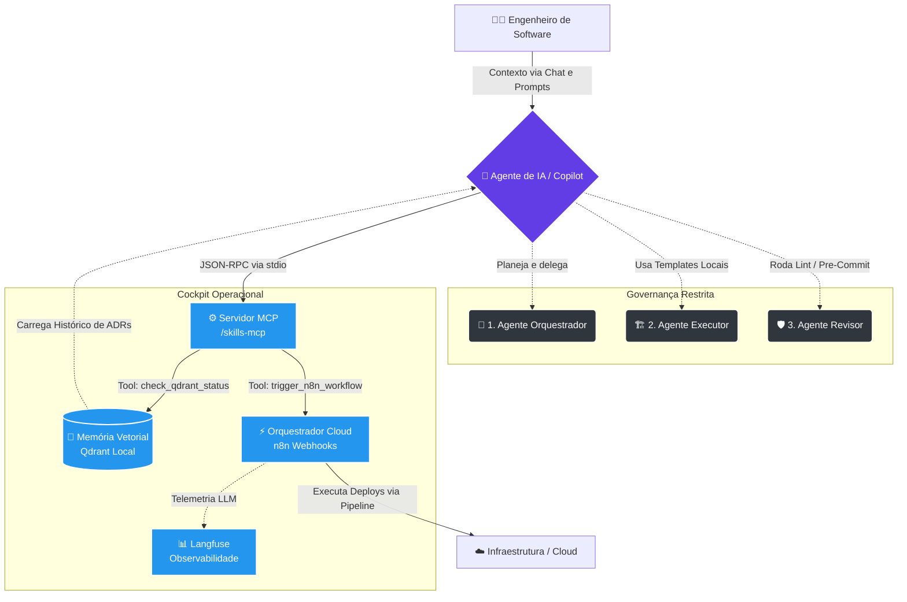

Esses passos garantem que sua estação esteja no estado padronizado pela plataforma.
# Personal Dev Workspace — Platform Engineering (Cloud & MLOps)

Bem-vindo ao repositório central de automação e plataforma. Este projeto define e aplica as políticas, ferramentas e padrões que mantenho como base para todas as minhas estações de trabalho e repositórios de infraestrutura.

   

---

##  Visão geral

Este repositório agrupa:

- Automação de estação (Ansible / scripts)
- Dotfiles e symlinks (GNU Stow)
- Modelos e módulos de infraestrutura (Terraform)
- Regras de governança e agentes (AGENTS.md, ADRs)

Mantemos a **Segurança Shift-Left** com `pre-commit` e detecção local de segredos para evitar vazamento antes do push.

---

##  Primeiros passos

1. Bootstrap (máquina nova):

```bash
./scripts/setup-machine.sh
```

2. Aplicar playbook principal (instala Ansible se necessário):

```bash
make setup-workstation
```

3. Ativar dotfiles (stow):

```bash
cd dotfiles
stow zsh
stow git
stow vscode
```

---

##  Rotinas principais

Use o `Makefile` como ponto de entrada para tarefas comuns:

```bash
make format      # formata código / terraform
make lint        # roda linters locais e pre-commit
make test        # executa testes unitários
```

Para infra (ex.: `templates/terraform-aws-base/envs/dev`):

```bash
cd infra/<stack>/envs/dev
make plan
make apply
```

---

##  Operações diárias

Consulte `playbooks/` para runbooks, checklist de início de dia e procedimentos de validação.

---

## Governança e Agentes

Leia `AGENTS.md` e os ADRs em `docs-referencia/adr/` antes de submeter alterações significativas. As regras definem padrões de idempotência, segurança e separação de responsabilidades entre módulos e ambientes.

---

##  Gestão Centralizada de Agentes (AI Cockpit)

Para manter a governança arquitetural com uso de IA (ex: GitHub Copilot), foi desenvolvida uma **Plataforma de Agentes em Tríade** conectada a um Servidor MCP, garantindo que IAs codifiquem seguindo nossos templates, possuam memória do projeto e executem webhooks em nuvem.



### 🧩 Entendendo o Fluxo (Legenda):
- **O Cérebro Limitado (Personas)**: A inteligência artificial neste repositório não tem permissão para escrever código "free-style". Ela é forçada a assumir o papel restrito de arquitetura, execução (copiando templates) ou de auditor severo (Shift-Left).
- **O Tradutor (Servidor MCP)**: É um motor TypeScript local que ensina para as IAs como interagir com as ferramentas da nossa plataforma.
- **A Memória (Qdrant Vector DB)**: Roda embarcado localmente. Permite à IA resgatar "experiências passadas" e diretrizes para ter contexto _antes_ de conversar com o usuário.
- **Os Braços Mecânicos (n8n + Langfuse)**: Em vez do Agente cuspir scripts Python inseguros, ele aperta "botões" no n8n na nuvem, que por sua vez cuida da orquestração real sem expor nossa máquina. O Langfuse rastreia todo custo, tokens e falhas desse fluxo em uma dashboard.

> 💡 **Para operar a IA no dia a dia**, leia o **[Guia de Bolso Oficial](gestao-centralizada-agents/guia-de-bolso.md)** contendo os atalhos e promptings reais.
