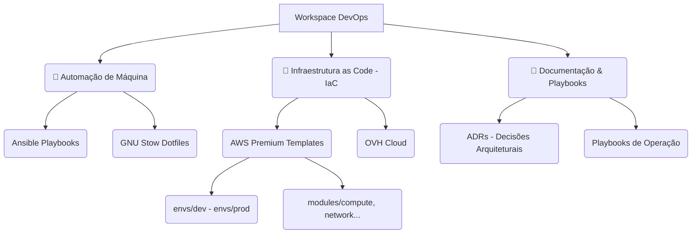

# 🚀 Workspace DevOps & Platform Engineering

[](https://github.com/diegosantos-ai/dev-workspace/actions/workflows/ci-lint-sec.yml)
[](https://github.com/diegosantos-ai/dev-workspace/actions/workflows/terraform-plan.yml)

Bem-vindo ao centro nervoso de infraestrutura, automação e configurações (dotfiles) orientadas ao mais alto padrão de mercado. Este repositório atua como um produto contínuo de Engenharia de Plataforma.

## 🏗️ Arquitetura do Workspace



## 🛠️ Capacidades Principais

- **🛡️ Shift-Left Security:** Nenhum segredo ou configuração ruim passa localmente graças a stack estrita de Hooks (`pre-commit`, `gitleaks`, `tflint`, `tfsec`, `shellcheck`).
- **♻️ Automação Idempotente:** O Setup de suas novas máquinas está garantido por **Ansible** via `make setup`.
- **☁️ IaC Desacoplada:** Código de Nuvem padronizado em Workspaces Isolados (`multi-ambiente`) garantindo 0 risco de explosão e reutilização máxima.

## 🚀 Como Iniciar (Nova Máquina)

Clone o repositório e rode o comando principal da nossa Plataforma:

```bash
make setup
```

## 📐 Padrões & Regras de Design

Antes de alterar o comportamento arquitetural do repositório, consulte nossos Registros de Decisão (ADRs) documentados em [`docs-referencia/adr`](docs-referencia/adr/).

---
**Gerenciado via GNU Make | Blindado por Pre-Commit | Versionado por GitHub Actions**
