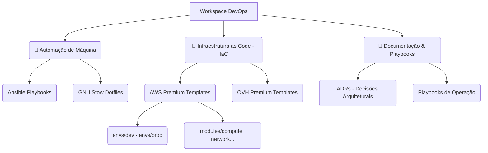

# 🚀 Workspace DevOps & Platform Engineering

[](https://github.com/diegosantos-ai/dev-workspace/actions/workflows/ci-lint-sec.yml)
[](https://github.com/diegosantos-ai/dev-workspace/actions/workflows/terraform-plan.yml)

Bem-vindo ao centro nervoso de infraestrutura, automação e configurações (dotfiles) orientadas ao mais alto padrão de mercado. Este repositório atua como um produto contínuo de Engenharia de Plataforma.

## 🏗️ Arquitetura do Workspace



## 🛠️ Capacidades Principais

- **🛡️ Shift-Left Security:** Nenhum segredo ou configuração ruim passa localmente graças a stack estrita de Hooks (`pre-commit`, `gitleaks`, `tflint`, `tfsec`, `shellcheck`).
- **♻️ Automação Idempotente:** O Setup de suas novas máquinas está garantido por **Ansible** via `make setup`.
- **☁️ IaC Desacoplada:** Código de Nuvem padronizado em Workspaces Isolados (`multi-ambiente`) garantindo 0 risco de explosão e reutilização máxima.
- **🤖 AI Governance (Prompt-as-Code):** O ambiente orquestra agentes de IA baseando-se em diretivas injetadas diretamente nas configurações do compilador/Editor (via dotfiles). Zero alucinação nos setups.

## 🚀 Como Iniciar (Nova Máquina)

Clone o repositório e rode o comando principal da nossa Plataforma. Assegure a infra local de "Cockpit":

```bash
git clone https://github.com/diegosantos-ai/dev-workspace.git ~/docs/dev-workspace
cd ~/docs/dev-workspace
make setup
```
Para inicializar seu dia com os Checks (Docker, Git, Sec), basta rodar `make morning`.

## 📐 Padrões & Regras de Design

Antes de alterar o comportamento arquitetural do repositório, consulte nossos Registros de Decisão e Setup:
1. **ADRs (`docs-referencia/adr`):** Registro de decisões técnicas.
2. **PPO (`playbooks/`):** Os procedimentos universais e operacionais.

---

## 💼 Sobre esta Arquitetura (Skills Profiling)
Este repositório não é um mero acumulador de scripts bash, mas sim a prova-de-conceito de proficiência sólida em **Engenharia de Plataforma e SRE**. Ele evidencia domínio real sobre:
*   **Idempotência e Declaratividade:** Capacidade de abolir manuais em favor de IaC madura e configurações gerenciadas (Ansible + GNU Stow).
*   **Segurança Incorporada (Shift-Left):** Estruturação que prova que a segurança não ocorre "na nuvem", mas é travada no pre-commit (Gitleaks, Checkov) em tempo de desenvolvimento.
*   **DX / Experiência do Desenvolvedor:** Capacidade vital de reduzir carga cognitiva da equipe através de ferramentas centralizadas (entrypoints em `Makefile` e Telemetria Matinal via CLI isolada).
*   **AI Architecture Governance:** Visão avançada no controle de grandes modelos de linguagem (LLMs). Engenharia de Prompt centralizada no pipeline do time, garantindo que IAs não gerem desvio do padrão arquitetural de refatoração ou acasalamento de módulos.
*   **Gestão de Estado em Terraform:** Maturidade inegociável na separação de logic states (Environments Vs. Modules blocks e state lock via DynamoDB/S3).
