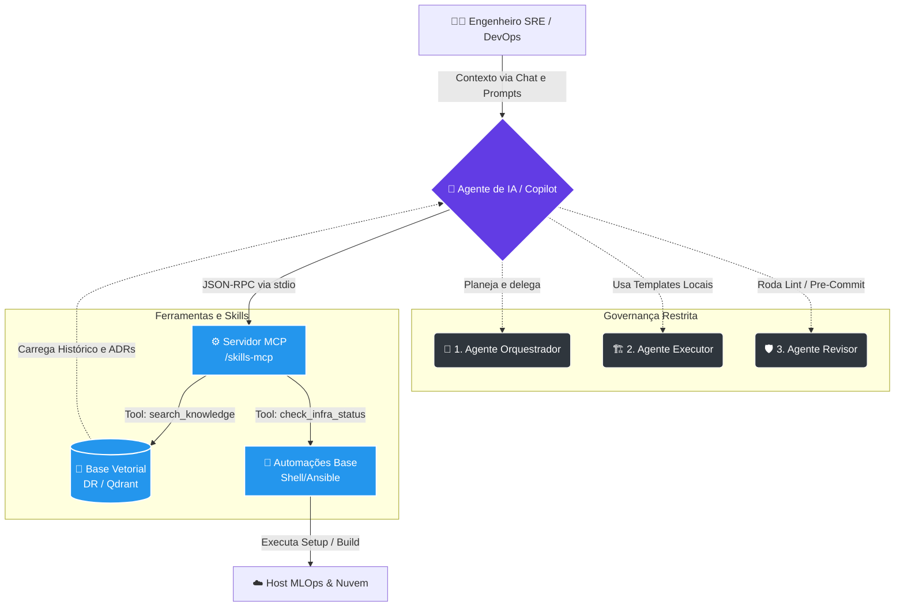

# 🚀 Dev Workspace — Plataforma de Engenharia Interna (IDP)

Bem-vindo ao repositório central do meu ecosistema de desenvolvimento cloud-native. Este projeto deixou de ser apenas um repositório de dotfiles para se tornar uma verdadeira **Plataforma de Automação, Governança de IA e Operações DevOps**.

    

---

## 🏗️ Domínios da Plataforma (Arquitetura Modular)

A base de código é dividida por limites de responsabilidade estritos:

- 🛡️ **`sanidade-ambiente/`**: *Shift-Left Operacional*. Testes que verificam a saúde da infraestrutura (Docker, Git, SDKs) e bloqueiam execuções caso o host esteja degradado.
- 👔 **`gestao-centralizada-agents/`**: *O "AI Cockpit"*. Centraliza manifestos de IA (`AGENTS.md`), regras de comportamento e o servidor MCP (Skills) conectando o Copilot à automações externas.
- ⏱️ **`rotina-devops/`**: *Operações e Diário de Bordo*. Scripts estruturados para check-in (`day-start`), logs e fechamentos de dia/semana (`day-close`).
- ☁️ **`templates/ & infra/`**: IaC (Terraform) seguro e modular, reforçando a separação entre lógica de provisionamento e injeção de estados (envs).
- ⚙️ **`ansible/ & dotfiles/`**: Bootstrap idempotente de máquina via playbooks (APTs, Snaps) e espelhamento de configurações via GNU Stow.

---

## 🌍 O Roteador Central (Global Makefile)

Todo o ecossistema é dirigido pelo `Makefile` raiz. Além de operar o core da plataforma, **projetos externos podem herdar as automações e lints diretamente daqui** utilizando a injeção da variável `DEV_WORKSPACE`.

```bash
# Como adotar as regras desta Plataforma em um repositório "cliente" isolado:
~/dev-workspace/gestao-centralizada-agents/scripts/adopt_governance.sh .
```

### Comandos de Operação Diária
```bash
make help        # Lista todos os recursos disponíveis na plataforma
make env-check   # Validação "frictionless" de saúde do docker/host (pass-fail)
make morning     # Executa verificações e abre o checklist matinal
make day-start   # Inicia e abre o Diário de Bordo para registro de contexto
make setup       # Aciona a esteira do Ansible para configurar dependências
make lint        # Passa crivagem rigorosa de bugs e hardcoded secrets via pre-commit
```

---

## 🤖 Gestão Centralizada de Agentes (AI Cockpit)

Para manter o rigor arquitetural e a segurança sob IA, o repositório amarra nativamente a atuação de *LLMs* a uma Tríade de Governança, estendendo capacidades via servidor MCP.



### 🧩 Entendendo a Dinâmica da IA (Legenda):
- **O Cérebro Restrito (Personas)**: A IA não tem permissão para escrever código "free-style" solto na raiz. Ela assume as personas restritas documentadas visando sempre o padrão Idempotente e Shift-Left.
- **O Tradutor (Servidor MCP)**: Motor Typescript que expõe as ferramentas, bash scripts e logs para a IA analisar de forma determinística, impedindo alucinações.
- **Guardiões**: Alterações são validadas através da injeção imediata nos arquivos de log/worklog e submetidas automaticamente aos lints de segurança antes do commit.

> 💡 **Quer explorar comandos avançados?** Consulte a documentação interna na pasta `/rotina-devops` e os registros em `/docs-referencia`.
