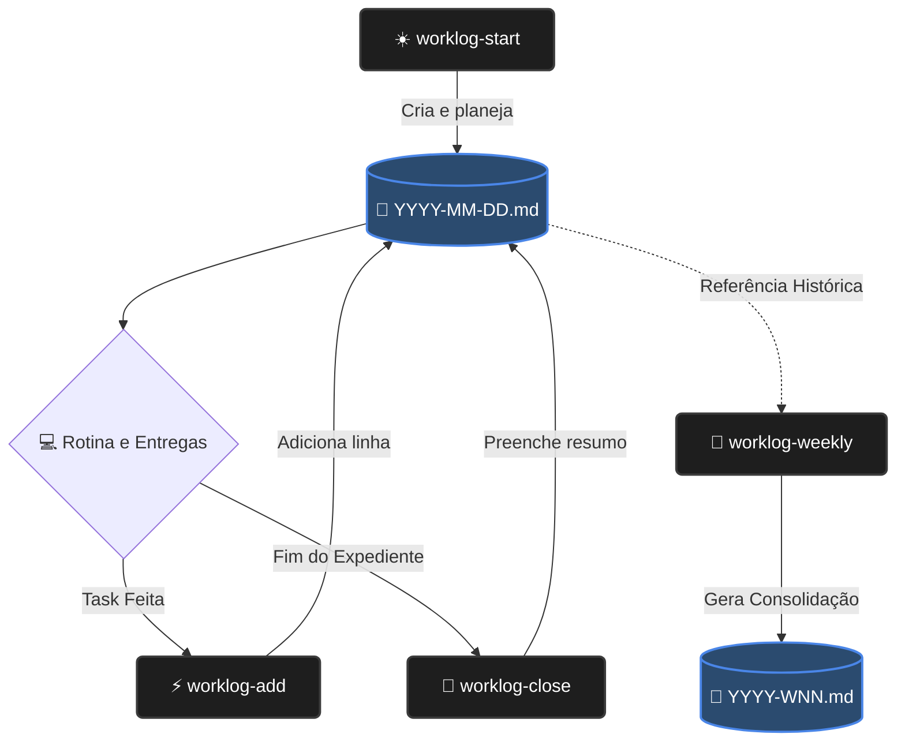

# Módulo: Rotina DevOps (Worklog Pessoal)

Um microssistema focado em CLI para gerenciamento de tempo, registro diário de atividades e consolidação de entregas. Desenhado visando eliminar a fricção cognitiva no dia a dia do Engenheiro de Software / DevOps.

---

## 🎯 O que é e qual problema resolve?

**O que é:** Um rastreador de atividades (worklog) puramente baseado em arquivos Markdown (texto plano) manipulados via scripts Bash inteligentes.

**O problema:** Durante o dia, um engenheiro muda de contexto dezenas de vezes (troubleshooting, reuniões, infraestrutura, estudos). Preencher ferramentas visuais complexas (Jira, Notion, planilhas) gera atrito e quebra o estado de *flow*. Resultado: na sexta-feira, é difícil lembrar dos micro-impactos e das pequenas entregas.

A `rotina-devops` resolve isso através do terminal. O engenheiro abre o dia, insere logs ao longo das tarefas e fecha o expediente utilizando comandos rápidos que não exigem a abertura obrigatória de sistemas pesados.

---

## 🔄 Fluxo de Uso Diário (Worklog Flow)



**Legenda do Fluxo (Como funciona em 30 segundos):**
1. **Manhã:** Você digita o comando de *Start* no terminal. Responde 3 perguntinhas rápidas (foco do dia). Um arquivo de texto é criado isolando o dia.
2. **Ao longo do Expediente:** Terminou de fazer o deploy ou saiu de uma reunião? Roda o comando de *Add*. A anotação vai direto pro arquivo sem você precisar sair da tela do terminal.
3. **Fim do Dia:** Vai fechar a tampa do notebook? Roda o *Close*. Responde rápido o que deu certo, os problemas e desliga o cérebro em paz.
4. **Sexta-feira:** Roda o *Weekly*. Ele compila seu esforço da semana num arquivo único limpo para reporte real de resultados.

---

## 📂 Estrutura de Diretórios e Scripts

```text
rotina-devops/
├── README.md                      # Esta documentação da arquitetura
├── MELHORIAS-FUTURAS.md           # Backlog gerenciado de roadmap
├── scripts/
│   ├── worklog-start.sh           # Abre o dia e define o "Plano"
│   ├── worklog-add.sh             # Adiciona eventos com timestamp e impacto
│   ├── worklog-close.sh           # Interativo: sumário diário e bloqueios
│   └── worklog-weekly.sh          # Gera relatório semanal ISO-Week e lista logs
└── worklog/
    ├── daily/                     # Repositório de arquivos YYYY-MM-DD.md
    ├── projects.yaml              # Dicionário de projetos e tags base
    ├── templates/                 # Matrizes Markdown imutáveis (Modelos)
    └── weekly/                    # Repositório de arquivos de ciclo (ex: 2026-W12.md)
```

---

## 🛠️ Exemplos de Uso na CLI (Global)

Todos os comandos devem ser executados a partir de qualquer diretório pelo atalho global do \`Makefile\` na raiz do projeto.

```bash
# 1. Chegou para o trabalho:
make day-start
# Prompt interativo perguntará seu objetivo do dia e abrirá no seu editor.

# 2. Registrando um evento no calor do momento:
make log
# Entrará no modo wizard iterativo (Projeto? Tipo? Ação?...)

# 2.1 Registrando evento num comando só (Para usuários avançados - modo ninja):
make log ARGS="lab-docker execucao 'Criação do docker-compose' 'Containers de pé' alto"

# 3. Fechando as atividades daquele dia:
make day-close
# Prompt interativo perguntará o saldo e se houve bloqueios.

# 4. Sexta-feira às 17h (Saindo pro fds):
make week-close
# Prepara seu relatório da semana, exibe o retrospecto no terminal e abre o arquivo.
```

---

## 📄 Formatos Adotados

### O Arquivo Diário (`daily-template.md`)
Possui exatamente 3 delimitações fixas focadas em modelo mental limpo:
1. **Plano do Dia:** A intencionalidade gerada de manhã.
2. **Eventos (Log):** A listagem cronológica do que realmente aconteceu (inserido via append do `worklog-add`).
3. **Fechamento:** O de-briefing focado em saldo e aprendizado.

### O Arquivo Semanal (`weekly-template.md`)
Foco exclusivo na transição de "horas trabalhadas" para "valor gerado". Possui blocos para métricas macros:
- Evoluções reais (entregas)
- Estudos aplicados
- Bloqueios recorrentes
- Próximos passos diretivos

---

## 🧠 Decisões de Design de Engenharia
- **Idempotência Estrita:** Todos os scripts usam tratativas (`if/else` e regex via `sed`) para garantir que possam ser rodados múltiplas vezes sem sobrescrever logs passados, não importando a ordem em que foram chamados.
- **Armazenamento em Plain-text:** Não usa bancos SQlite locais ou dependências. Marcadores do markdown tornam a busca nativa por `grep` um banco de dados natural perfeito.
- **Portabilidade:** Scripts dependem apenas de ferramentas core-utils do Bash, sendo compatíveis com praticamente qualquer sistema POSIX sem instalações adicionais.

---

## 🚀 Próximos Passos (Evolução)
Consultar ativamente o arquivo `MELHORIAS-FUTURAS.md`. Nenhuma feature é empurrada para este módulo se não passar por um filtro agressivo contra complexidade fútil ("maquiagem").
A prioridade futura é a integração desses scripts à raiz via **Entrypoints globais em Makefile** (`make rotina-start`).
