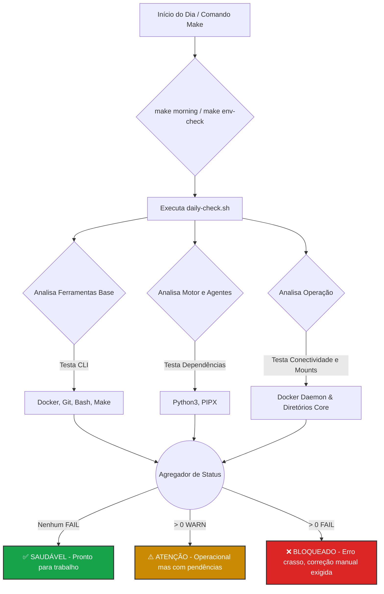

# Sanidade de Ambiente (Environment Sanity)

Módulo core responsável por garantir que a infraestrutura local, agentes de IA e ferramentas do DevOps Workspace estejam sempre operacionais e seguras antes do início do fluxo de trabalho.

## 🎯 O Problema que Resolve

Muitos dias de engenharia são desperdiçados rodando scripts sem perceber que o daemon do Docker falhou, que credenciais expiraram ou que os linters sumiram do `$PATH`.
Ao invés de investigar problemas na hora do "apagão", a `sanidade-ambiente` age de forma pre-emptiva (*Shift-Left*), bloqueando execuções de risco e sinalizando problemas operacionais no minuto 0 do dia de trabalho.

## ⚙️ Diferença de Escopo

Dentro da plataforma, dividimos as checagens em dois níveis:

*   **Check Diário (`daily-check`):** Rápido, passivo e imediato. Fricção zero. Confirma apenas se o setup mínimo de sobrevivência (Shell, Docker, Git, PIPX) está no ar.
*   **Auditoria / Manutenção (`env-audit`):** Profundo, demorado e focado em compliance. Checa *drift* de ferramentas, atualiza caches, varre rootkits e credenciais voadoras. *(A ser expandido)*

---

## 📂 Estrutura do Módulo

```text
sanidade-ambiente/
├── README.md               # Esta documentação
├── scripts/                # Lógica core passiva/ativa
│   ├── daily-check.sh      # Verificação diária rápida
│   └── env-audit.sh        # Varredura profunda (compliance)
├── reports/                # Output de auditorias e logs de vulnerabilidade
└── templates/              # Formatos padronizados (JSON, HTML, MD) para os relatórios
```

---

## 🚀 Como Funciona o Fluxo? (Diagrama)



**Legenda do Fluxo (30 segundos):**
O trigger é acionado (manualmente ou pela rotina matinal). O script audita categorias operacionais divididas em Blocos de CLI (ferramentas vitais), Motores (Para as IAs locais não quebrarem) e Operação (Se o hardware/mounts estão ok). Logo em seguida compila tudo classificando como Seguro (Verde), Degradado (Amarelo) ou Falha Crítica de Infra (Vermelho).

---

## 🛠️ O que o `daily-check.sh` verifica hoje?

A versão atual garante o *Sanity Check* contra:
- **Base de Shell**: `bash`, `git`, e `make`.
- **Stacks Principais**: `docker`, `docker-compose`, `python3` e `pipx` (base do motor *CrewAI/Agentes*).
- **Saúde Operacional (Runtime)**: Se o daemon do Docker responde para deploy, se a pasta atual tem um track válido no Git local, e se a estrutura vital de diretórios não foi corrompida.

### Interpretação dos Níveis de Alerta
- `✅ [ OK ]`: O alvo está saudável e ativo.
- `⚠️ [ WARN ]`: Algo opcional está faltando ou mal configurado, mas *não impede* a construção do código de evoluir (Ex: *pipx* faltando).
- `❌ [ FAIL ]`: Falha estrutural bloqueante! (Ex: *Docker CLI ausente* ou *Docker Daemon morto*). Finaliza o script com status `exit 1`.

---

## 💻 Como Executar

A preferência é utilizar sempre a interface padronizada do `Makefile` da raiz:

**1. Apenas rodar o check de Sanidade local (Isolado e rápido)**
```bash
make env-check
```

**2. Imbutido no "Ritual Matinal" (Abre relatórios junto)**
```bash
make morning
```

**3. Execução bruta (Via Script/CI)**
```bash
./sanidade-ambiente/scripts/daily-check.sh
```

---

## 🔮 Fora de Escopo (V1) e Próximos Passos
**Na V1, este módulo é focado inteiramente na foto estática (Status check).**
O que **não** fazemos agora:
- Correção / Auto-Fix (Ele reporta, não corrige pacotes).
- Upgrades de softwares desativados (Não usamos `apt update` por aqui).
- Validação profunda de rede ou credenciais remotas simuladas (Ping para AWS).

**Futuro:**
- Acionar `env-audit.sh` como job profundo do `make audit`.
- Plugar a validação matinal `env-check` à hooks de Git pre-commit (Garantir que nunca haja push sem credenciais estarem sanitizadas).
